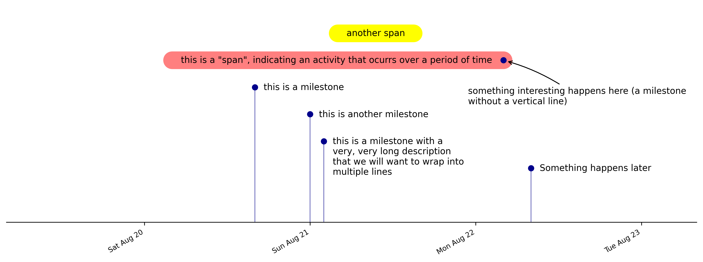

# Timeline-Generator

Create visual timelines for post-incident investigations and other purposes.

## Purpose

Easy creation of pretty, detailed, repeatable, and customizable timelines based on structured data.

I wanted to be able to put all timeline data into a structured format and use that to generate one or more visualizations. 

I played with both [mermaid.js](https://mermaid-js.github.io/mermaid/#/) and [PlantUML](https://plantuml.com/) which are awesome, however neither does a good job of representing detailed timelines.

After using Excel to create a few timelines, I decided to start using matplotlib because it makes a lot more sense to do this in code.

## Features

- Milestones (an event that occurs at a specific time)
- Spans (an event that has a start time and an end time)
- Several customization options
- Use any date/time format understood by [pandas.to_datetime](https://pandas.pydata.org/docs/reference/api/pandas.to_datetime.html)
- Save timelines to PNG, SVG, PDF (type detected by output filename)

## Prerequisites

- Python 3
- pandas library (e.g. `pip install pandas`)
- matplotlib library (e.g. `pip install matplotlib`)

## Using

See [This jupyter notebook for help and examples](demo/timeline.ipynb)